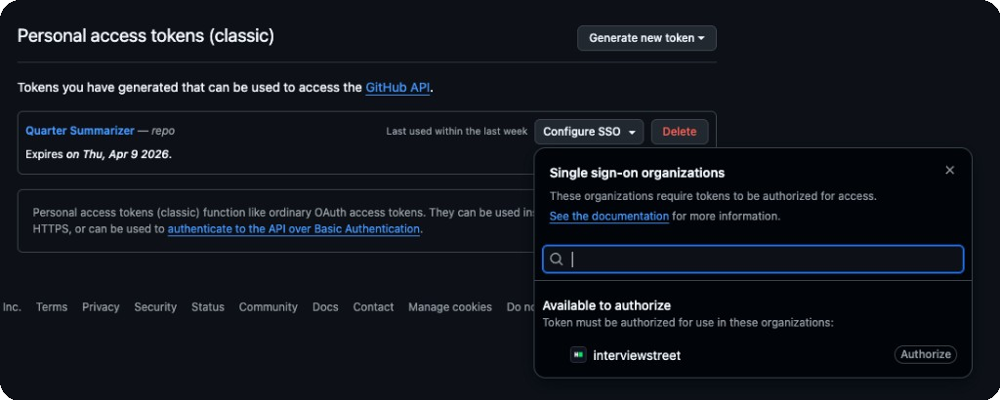

<div align="center">

# Quarter Summarizer 📝

Turn your merged pull requests into performance-review-ready narratives - powered by AI.

</div>

---

Quarter Summarizer fetches your merged PRs from a GitHub organization, classifies them by impact, and streams a first-person self-review summary using the LLM of your choice. Pick a quarter (or custom date range), select a model, and get a polished write-up in seconds - so you can spend your time shipping code, not writing self-reviews.

> [!NOTE]
> The quality of the generated summary depends on the quality of your PR descriptions. The more context your PRs have, the better the narrative — a little effort at merge time goes a long way at review time!

## Getting Started

### Prerequisites

- [Docker](https://docs.docker.com/get-docker/) & [Docker Compose](https://docs.docker.com/compose/install/)

### Create a GitHub Personal Access Token

A **classic** PAT is required to fetch pull request data from GitHub.

1. Go to **[Settings → Developer settings → Tokens (classic)](https://github.com/settings/tokens)**
2. Click **Generate new token (classic)**
3. Select the **`repo`** scope (needed to access PRs in private repositories)
4. Copy the token — you'll need it in the next step
5. If you want to analyze PRs from an **organization's** repositories, click **Configure SSO** next to the token and **Authorize** it for that org

   

### Clone the Repository

```bash
git clone https://github.com/your-username/quarter-summarizer.git
cd quarter-summarizer
```

### Configure Environment

```bash
cp backend/.env.example backend/.env
```

Open `backend/.env` and fill in your values:

| Variable                       | Required | Description                                                                          |
| ------------------------------ | :------: | ------------------------------------------------------------------------------------ |
| `GITHUB_PERSONAL_ACCESS_TOKEN` |   Yes    | Classic GitHub PAT with `repo` scope                                                 |
| `LLM_API_KEY`                  |    No    | API key for your LLM provider (e.g. OpenAI, Anthropic)                               |
| `LLM_BASE_URL`                 |    No    | Base URL of the provider's API (e.g. `https://api.openai.com/v1`)                    |
| `DEVELOPER_ROLE`               |    No    | Your role, used to add context to the generated narrative (e.g. `Frontend Engineer`) |

> [!TIP]
> **No access to a paid LLM?** The app falls back to [Ollama](https://ollama.com) automatically when `LLM_API_KEY` and `LLM_BASE_URL` are left blank. Just install Ollama on your machine, pull a model (`ollama pull llama3`), and you're good to go.

### Run with Docker Compose

```bash
docker compose -f docker-compose.prod.yml up -d --build
```

Once running, open **http://localhost**.

## Development

Start the development stack with hot-reload support:

```bash
docker compose -f docker-compose.dev.yml up --build
```

| Service          | URL                   |
| ---------------- | --------------------- |
| Frontend (Vite)  | http://localhost:5173 |
| Backend (NestJS) | http://localhost:3001 |

### Live Code Sync

Source files are volume-mounted into the containers. Edit code on your host and changes are picked up instantly — Vite HMR for the frontend, NestJS watch mode for the backend. No rebuild needed.

### Debugging the Backend

The dev stack exposes port `9229` for the Node.js inspector and the backend starts in debug mode by default.

1. Add `debugger` statements in the backend source code
2. In VS Code, run the **Debug NestJS app in Docker** launch configuration to attach

## Contributing

Contributions are welcome! Please see [CONTRIBUTING.md](CONTRIBUTING.md) for guidelines on how to get started.

## License

This project is licensed under the [MIT License](LICENSE).
